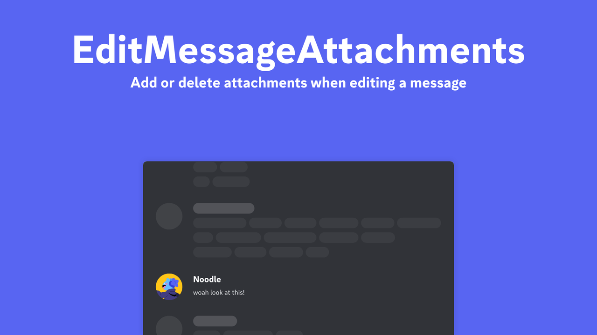

:warning: **Development moved at https://github.com/FedeIlLeone/replugged-plugins**

---

# EditMessageAttachments

Replugged plugin which you can add or delete attachments when editing a message.

